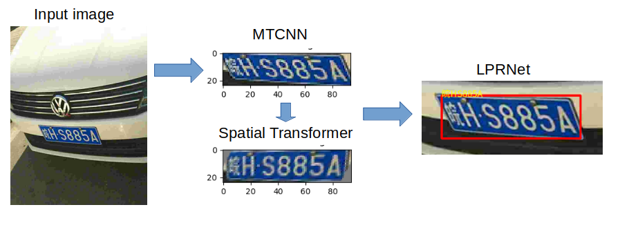
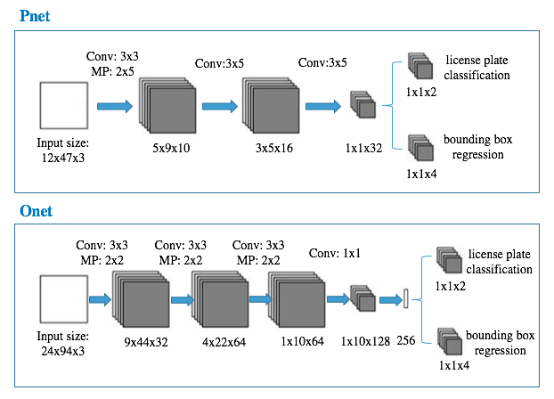

# License_Plate_Detection_Pytorch
This is a two stage lightweight and robust license plate recognition in MTCNN and LPRNet using Pytorch. [MTCNN](https://arxiv.org/abs/1604.02878v1) is a very well-known real-time detection model primarily designed for human face recognition. It is modified for license plate detection. [LPRNet](https://arxiv.org/abs/1806.10447), another real-time end-to-end DNN, is utilized for the subsquent recognition. This network is attributed by its superior performance with low computational cost without preliminary character segmentation. The [Spatial Transformer Layer](https://arxiv.org/abs/1506.02025) is embeded in this work to allow a better characteristics for recognition. The recognition accuracy is up to **99%** on CCPD base dataset with ~ **80 ms/image** on Nivida Quadro P4000. Here is the illustration of the proposed pipeline:

## MTCNN
The modified MTCNN structure is presented as below. Only proposal net (Pnet) and output net (Onet) are used in this work since it is found that skipping Rnet will not hurt the accuracy in this case.  The Onet accepts 24(height) x 94(width) BGR image which is consistent with input for LPRNet. 

## LPRNet Performance 
LPRNet coding is heavily followed by [sirius-ai](https://github.com/sirius-ai/LPRNet_Pytorch)'s repo. One exception is that the spatial transformer layer is inserted to increase the accuracy reported on CCPD database as below: 

|   | Base(45k) | DB | FN | Rotate | Tilt | Weather | Challenge |
|  :------:     | :---------: | :---------: |:---------: |:---------: |:---------: |:---------: |:---------: |
|   accuracy %      | 99.1     |  96.3 | 97.3 | 95.1 | 96.4 | 97.1 | 83.2 |

## Training on MTCNN
* Download the [CCPD](https://github.com/detectRecog/CCPD) data and put it into 'ccpd' folder
* run 'MTCNN/data_set/preprocess.py' to split training data and validation data and put in "ccpd_train" and "ccpd_val" folders respectively.
* run 'MTCNN/data_preprocessing/gen_Pnet_train_data.py', 'MTCNN/data_preprocessing/gen_Onet_train_data.py','MTCNN/data_preprocessing/assemble_Pnet_imglist.py', 'MTCNN/data_preprocessing/assemble_Onet_imglist.py' for training data preparation.
* run 'MTCNN/train/Train_Pnet.py' and 'MTCNN/train/Train_Onet.py

## Training on LPRNet
* run 'LPRNet/data/preprocess.py' to prepare the dataset
* run 'LPRNet/LPRNet_Train.py' for training 

## Test
* run 'MTCNN/MTCNN.py' for license plate detection
* run 'LPRNet/LPRNet_Test.py' for license plate recognition
* run 'main.py' for both

## Reference
* [MTCNN](https://arxiv.org/abs/1604.02878v1)
* [LPRNet](https://arxiv.org/abs/1806.10447)
* [Spatial Transformer Layer](https://arxiv.org/abs/1506.02025)
* [LPRNet_Pytorch](https://github.com/sirius-ai/LPRNet_Pytorch)

**Please give me a star if it is helpful for your research**
